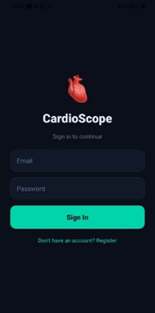
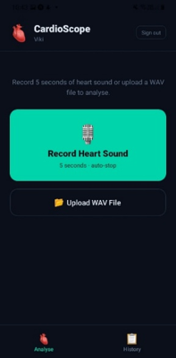
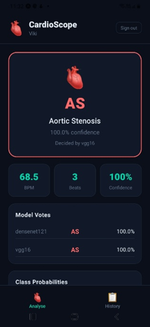
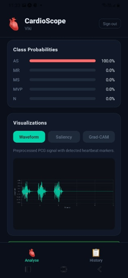
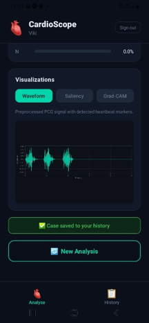
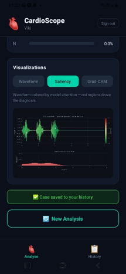
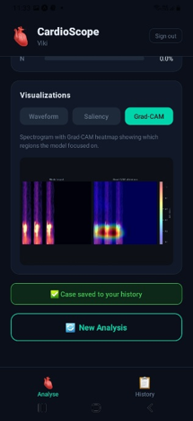
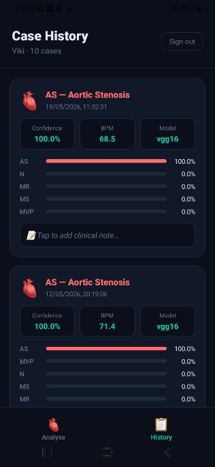
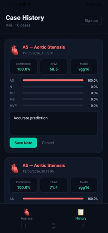

# CARDIOSCOPE: AN AI-BASED PLATFORM FOR PHONOCARDIOGRAM ANALYSIS

<table>
  <tr>
    <td></td>
    <td></td>
    <td></td>
  </tr>
  <tr>
    <td></td>
    <td></td>
    <td></td>
  </tr>
  <tr>
    <td></td>
    <td></td>
    <td></td>
  </tr>
</table>

 ## Overview
 
CardioScope is a clinical AI platform that classifies phonocardiogram (PCG) recordings into five specific valvular heart disease categories:
 
| Code | Condition |
|---|---|
| **AS** | Aortic Stenosis |
| **MR** | Mitral Regurgitation |
| **MS** | Mitral Stenosis |
| **MVP** | Mitral Valve Prolapse |
| **N** | Normal |
 
Unlike existing commercial solutions such as Eko Health and eMurmur — which only detect normal vs abnormal heart sounds — CardioScope identifies the **specific valvular condition**, providing clinically actionable output to medical professionals.
 
The platform exposes two access points:
- **Mobile Application** — a React Native app for doctors providing audio capture, classification, Grad-CAM explainability, BPM estimation, and case management
- **REST API** — a Flask inference backend deployed on Google Cloud Run, accessible through a Google API Gateway for external service integration
---


## Key Features
 
- **5-class valvular disease classification** — AS, MR, MS, MVP, Normal
- **Dual feature fusion** — Wavelet Scattering Transform (WST) + Mel-spectrogram
- **Two-model ensemble** — VGG16 + DenseNet121 with confidence-based selection
- **Grad-CAM explainability** — saliency waveform + spectrogram heatmap overlay
- **BPM estimation** — Hilbert envelope peak detection
- **Cross-platform mobile app** — Android and iOS via React Native + Expo
- **Cloud deployment** — Google Cloud Run + API Gateway
- **Case management** — Firebase Firestore with per-user access control
- **Secure authentication** — Firebase Authentication
---


## Repository Structure
 
```
CardioScope/
│
├── ModelTraining/
│   └── train.py                  ← Training pipeline for all 6 models
│
├── CloudRunDeployment/
│   ├── app.py                    ← Flask inference API
│   ├── Dockerfile                ← Container configuration
│   ├── requirements.txt          ← Python dependencies
│   ├── deploy.py                 ← Cloud Run deployment script
│   └── openapi.yaml              ← API Gateway OpenAPI specification
│
└── ReactNativeApp/
    ├── app/
    │   ├── _layout.tsx           ← Root navigation layout
    │   ├── login.tsx             ← Authentication screen
    │   ├── register.tsx          ← Registration screen
    │   ├── modal.tsx             ← Modal screen
    │   └── (tabs)/
    │       ├── _layout.tsx       ← Tab bar configuration
    │       ├── index.tsx         ← Analysis screen
    │       └── history.tsx       ← Case history screen
    └── config/
        └── firebase.ts           ← Firebase configuration
```
 
---

## System Architecture
 
```
┌─────────────────────────────────────────────────────┐
│                  CardioScope Platform               │
│                                                     │
│  Mobile App              External Services          │
│  (Doctors)               (HIS, EHR, etc.)           │
│      ↓                          ↓                   │
│      ↓               Google API Gateway             │
│      ↓                          ↓                   │
│      └──────────────┬───────────┘                   │
│                     ↓                               │
│             Cloud Run (Flask API)                   │
│             ┌─────────────────┐                     │
│             │  Preprocessing  │                     │
│             │  WST + MFCC     │                     │
│             │  VGG16          │                     │
│             │  DenseNet121    │                     │
│             │  Grad-CAM       │                     │
│             │  BPM Estimation │                     │
│             └─────────────────┘                     │
│                     ↓                               │
│             Firebase (Auth + Firestore)             │
│             (Mobile app only)                       │
└─────────────────────────────────────────────────────┘
```
 
---
 
## The Inference Pipeline
 
```
Raw PCG Audio (.wav / .m4a)
        ↓
Stage 1 — Preprocessing
  • Resample to 4,000 Hz
  • Amplitude normalization
  • Bandpass filter (20–900 Hz)
  • Adaptive noise gate
  • Median filter
  • Pad / truncate → 20,000 samples
        ↓
Stage 2 — Feature Extraction (parallel)
  • Mel-spectrogram (60 mels · 20–1500 Hz)
  • Wavelet Scattering Transform (J=5 · Q=2)
        ↓
Stage 3 — Feature Fusion
  • Bicubic resize both → 256×256
  • Z-score normalize + average
  • Clamp [-3, 3] → min-max normalize
  • Replicate to 3 channels → tensor (3, 256, 256)
        ↓
Stage 4 — Dual-Model Inference
  • VGG16  → softmax probabilities
  • DenseNet121 → softmax probabilities
  • Select most confident model
        ↓
Stage 5 — Explainability + Heart Rate
  • Grad-CAM on winning model
  • BPM via Hilbert envelope peak detection
        ↓
Stage 6 — Response
  • JSON: class · confidence · BPM · probabilities
  • 4 base64 PNG visualizations
```
 
---

## Part 1 — Model Training
 
### Prerequisites
 
```bash
# Python 3.10 required
pip install torch torchvision torchaudio --index-url https://download.pytorch.org/whl/cu118
pip install librosa kymatio scipy numpy scikit-learn matplotlib
```

### Dataset
 
This project uses the **Yaseen Heart Sound Dataset** available on GitHub [https://github.com/yaseen21khan/Classification-of-Heart-Sound-Signal-Using-Multiple-Features-]

### Training
 
Update `DATASET_PATH` in `ModelTraining/train.py`:
 
```python
DATASET_PATH = "/path/to/your/heart_sounds"
```
 
Run training:
 
```bash
cd ModelTraining
python train.py
```
 
This trains 6 architectures — VGG16, VGG19, DenseNet121, EfficientNet-B2, MobileNet-V2, ResNet50 — and saves the best checkpoint for each as a `.pth` file.
 
### Models Trained
 
| Architecture | Parameters | Notes |
|---|---|---|
| VGG16 | 138M | Selected for deployment |
| VGG19 | 144M | Evaluated only |
| DenseNet121 | 8M | Selected for deployment |
| EfficientNet-B2 | 9M | Evaluated only |
| MobileNet-V2 | 3M | Evaluated only |
| ResNet50 | 25M | Evaluated only |
 
### Output
 
Trained model weights are saved as:
```
vgg16_best.pth
densenet121_best.pth
```
 
> **Note:** The `.pth` files are not included in this repository due to their large size. Train the models using the instructions above or contact the author for access.
 
---
 
## Part 2 — Cloud Run Deployment
 
### Prerequisites
 
- [Docker Desktop](https://www.docker.com/products/docker-desktop/) installed
- [Google Cloud CLI](https://cloud.google.com/sdk/docs/install) installed and authenticated
- A Google Cloud project with billing enabled
### Step 1 — Prepare Model Weights
 
Place your trained model weights in the `models/` directory:
 
```
CloudRunDeployment/
    models/
        vgg16.pth
        densenet121.pth
    app.py
    Dockerfile
    requirements.txt
    deploy.py
    openapi.yaml
```
 
> The models must be saved as plain state dictionaries. If your `.pth` files were saved with the full checkpoint format `{"model_state_dict": ..., "val_acc": ...}`, run the following to convert them:
 
```python
import torch
import torch.nn as nn
from torchvision.models import vgg16, densenet121
 
def build_classifier_head(in_features):
    return nn.Sequential(
        nn.Linear(in_features, 1024), nn.ReLU(inplace=True), nn.Dropout(0.5),
        nn.Linear(1024, 512),         nn.ReLU(inplace=True), nn.Dropout(0.25),
        nn.Linear(512, 5),
    )
 
for arch, pth in [("vgg16", "vgg16_best.pth"), ("densenet121", "densenet121_best.pth")]:
    if arch == "vgg16":
        model = vgg16(weights=None)
        model.classifier = build_classifier_head(model.classifier[0].in_features)
    else:
        model = densenet121(weights=None)
        model.classifier = build_classifier_head(model.classifier.in_features)
 
    checkpoint = torch.load(pth, map_location="cpu")
    model.load_state_dict(checkpoint["model_state_dict"])
    torch.save(model.state_dict(), f"CloudRunDeployment/models/{arch}.pth")
    print(f"Saved {arch}.pth")
```
 
### Step 2 — Build and Test Locally
 
```bash
cd CloudRunDeployment
 
# Build Docker image
docker build -t heart-pcg-api .
 
# Run locally
docker run -p 8080:8080 heart-pcg-api
 
# Test health endpoint
curl http://localhost:8080/health
 
# Test prediction
curl -X POST http://localhost:8080/predict \
  -F "audio=@/path/to/test.wav" \
  -o response.json
 
# Verify response
python -c "
import json
d = json.load(open('response.json'))
print('Class:', d['predicted_class'])
print('Label:', d['predicted_label'])
print('Confidence:', d['confidence'])
print('BPM:', d['bpm'])
print('Keys:', list(d.keys()))
"
```
 
### Step 3 — Deploy to Google Cloud Run
 
```bash
# Authenticate
gcloud auth login
gcloud config set project YOUR_PROJECT_ID
 
# Enable required APIs
gcloud services enable \
  run.googleapis.com \
  artifactregistry.googleapis.com \
  cloudbuild.googleapis.com
 
# Create Artifact Registry repository
gcloud artifacts repositories create heart-pcg-repo \
  --repository-format=docker \
  --location=us-central1
 
# Configure Docker authentication
gcloud auth configure-docker us-central1-docker.pkg.dev
 
# Build and push image using Cloud Build
gcloud builds submit \
  --tag us-central1-docker.pkg.dev/YOUR_PROJECT_ID/heart-pcg-repo/heart-pcg-api:v1 \
  .
 
# Deploy to Cloud Run
gcloud run deploy heart-pcg-api \
  --image us-central1-docker.pkg.dev/YOUR_PROJECT_ID/heart-pcg-repo/heart-pcg-api:v1 \
  --platform managed \
  --region us-central1 \
  --allow-unauthenticated \
  --memory 4Gi \
  --cpu 2 \
  --timeout 120
```
 
### Step 4 — Configure API Gateway (Optional)
 
```bash
# Enable API Gateway
gcloud services enable apigateway.googleapis.com
 
# Create API
gcloud api-gateway apis create cardio-api \
  --display-name="CardioScope Inference API" \
  --project=YOUR_PROJECT_ID
 
# Create API config
gcloud api-gateway api-configs create cardio-config-v1 \
  --api=cardio-api \
  --openapi-spec=openapi.yaml \
  --project=YOUR_PROJECT_ID
 
# Deploy gateway
gcloud api-gateway gateways create cardio-gateway \
  --api=cardio-api \
  --api-config=cardio-config-v1 \
  --location=us-central1 \
  --project=YOUR_PROJECT_ID
```
 
### API Reference
 
#### `GET /health`
Returns server status. No authentication required.
 
**Response:**
```json
{
  "status": "ok",
  "models": ["vgg16", "densenet121"],
  "device": "cpu"
}
```
 
#### `POST /predict`
Classifies a PCG audio recording.
 
**Request:** `multipart/form-data`
| Field | Type | Required | Description |
|---|---|---|---|
| audio | file | ✅ | WAV or M4A audio file |
 
**Response:**
```json
{
  "predicted_class": "AS",
  "predicted_label": "Aortic Stenosis",
  "confidence": 0.9121,
  "decided_by": "densenet121",
  "bpm": 74.3,
  "beats_detected": 6,
  "all_probabilities": {
    "AS": 0.9121, "MR": 0.02, "MS": 0.03, "MVP": 0.02, "N": 0.0179
  },
  "model_votes": {
    "densenet121": {"class": "AS", "confidence": 0.9121},
    "vgg16":       {"class": "AS", "confidence": 0.8340}
  },
  "waveform_image":      "<base64 PNG>",
  "saliency_waveform":   "<base64 PNG>",
  "gradcam_spectrogram": "<base64 PNG>",
  "spectrogram_image":   "<base64 PNG>"
}
```
 
**Example — Python:**
```python
import requests
 
response = requests.post(
    "https://your-cloud-run-url.a.run.app/predict",
    files={"audio": open("heart_sound.wav", "rb")}
)
result = response.json()
print(f"Condition: {result['predicted_label']}")
print(f"Confidence: {result['confidence'] * 100:.1f}%")
print(f"BPM: {result['bpm']}")
```
 
**Example — curl:**
```bash
curl -X POST https://your-cloud-run-url.a.run.app/predict \
  -F "audio=@heart_sound.wav"
```
 
---
 
## Part 3 — React Native Mobile Application
 
### Prerequisites
 
- [Node.js](https://nodejs.org) v20 LTS
- [Expo Go](https://expo.dev/client) app installed on your Android or iOS device
- A Firebase project with Authentication and Firestore enabled
### Step 1 — Install Dependencies
 
```bash
cd ReactNativeApp
npm install
npx expo install expo-av expo-document-picker expo-file-system
npm install firebase
```
 
### Step 2 — Configure Firebase
 
Create `config/firebase.ts` with your Firebase project credentials:
 
```typescript
import { initializeApp } from "firebase/app";
import { getAuth } from "firebase/auth";
import { getFirestore } from "firebase/firestore";
 
const firebaseConfig = {
  apiKey:            "YOUR_API_KEY",
  authDomain:        "YOUR_AUTH_DOMAIN",
  projectId:         "YOUR_PROJECT_ID",
  storageBucket:     "YOUR_STORAGE_BUCKET",
  messagingSenderId: "YOUR_MESSAGING_SENDER_ID",
  appId:             "YOUR_APP_ID",
  measurementId:     "YOUR_MEASUREMENT_ID",
};
 
const app = initializeApp(firebaseConfig);
export const auth = getAuth(app);
export const db   = getFirestore(app);
```
 
Get these values from:
1. [https://console.firebase.google.com](https://console.firebase.google.com)
2. Project Settings → Your Apps → Web App → Config
### Step 3 — Set Your Cloud Run Endpoint
 
In `app/(tabs)/index.tsx`, update the API URL:
 
```typescript
const API_URL = "https://your-cloud-run-url.a.run.app";
// or your API Gateway URL:
// const API_URL = "https://your-gateway-id.gateway.dev";
```
 
### Step 4 — Configure Firebase Services
 
**Enable Authentication:**
1. Firebase Console → Authentication → Get Started
2. Enable Email/Password provider
**Enable Firestore:**
1. Firebase Console → Firestore Database → Create Database
2. Start in test mode
3. Choose us-central1 region
**Set Security Rules:**
```javascript
rules_version = '2';
service cloud.firestore {
  match /databases/{database}/documents {
    match /{document=**} {
      allow read, write: if request.auth != null;
    }
  }
}
```
 
**Create Composite Index:**
The case history query requires a composite index. When you first open the History screen, an error will appear with a direct link to create it automatically. Click the link and create the index on:
- Collection: `cases`
- Field 1: `doctorId` — Ascending
- Field 2: `createdAt` — Descending
### Step 5 — Run the Application
 
```bash
cd ReactNativeApp
npx expo start
```
 
Scan the QR code with:
- **Android** — Expo Go app
- **iPhone** — Camera app
### Application Screens
 
| Screen | Description |
|---|---|
| Login | Email/password authentication |
| Register | Doctor account creation with name, email, hospital |
| Analysis | Record or upload PCG audio → get prediction |
| History | View all past cases with clinical notes |
 
### Database Structure
 
**`doctors` collection:**
```
doctors/{userId}
    name:      string
    email:     string
    hospital:  string (optional)
    createdAt: string (ISO timestamp)
```
 
**`cases` collection:**
```
cases/{autoId}
    doctorId:         string  ← links to doctors/{userId}
    doctorName:       string
    predictedClass:   string  ← AS | MR | MS | MVP | N
    predictedLabel:   string
    confidence:       number
    decidedBy:        string  ← vgg16 | densenet121
    bpm:              number
    beatsDetected:    number
    allProbabilities: object
    modelVotes:       object
    doctorNote:       string
    createdAt:        timestamp
```
 
---
 
## Environment Variables Summary
 
| Variable | Location | Description |
|---|---|---|
| `DATASET_PATH` | `ModelTraining/train.py` | Path to Yaseen dataset |
| `API_URL` | `ReactNativeApp/app/(tabs)/index.tsx` | Cloud Run endpoint URL |
| Firebase config | `ReactNativeApp/config/firebase.ts` | Firebase project credentials |
| `YOUR_PROJECT_ID` | Deployment commands | Google Cloud project ID |
 
---
 
## Known Limitations
 
- **Single dataset** — trained and evaluated on Yaseen dataset only; external validation on diverse clinical data has not been performed
- **Single-label classification** — cannot detect co-occurring valvular conditions
- **Internet required** — inference requires a network connection to the Cloud Run endpoint
- **Authentication persistence** — users must sign in on every app launch due to a Firebase SDK compatibility limitation
- **Cold start latency** — first request after idle period may take 30–60 seconds while Cloud Run initializes the container
- **Out-of-distribution inputs** — the model will classify any audio input as one of the five classes; non-cardiac audio will still receive a prediction with potentially high confidence
---
 
## Future Work
 
- Validation on a larger and more diverse clinical dataset
- Multi-label classification for co-occurring valvular conditions
- Integration with Bluetooth digital stethoscope hardware
- On-device inference using TensorFlow Lite for offline use
- API Gateway authentication using Firebase JWT
- Authentication session persistence
---
 
## Tech Stack
 
| Component | Technology |
|---|---|
| Model training | Python · PyTorch · librosa · kymatio |
| Inference server | Flask · gunicorn · Docker |
| Cloud deployment | Google Cloud Run · Artifact Registry |
| API management | Google API Gateway · OpenAPI 2.0 |
| Mobile app | React Native · Expo · TypeScript |
| Authentication | Firebase Authentication |
| Database | Firebase Firestore |
| Explainability | Grad-CAM · Matplotlib |
 
---
 
## Requirements
 
### Backend (CloudRunDeployment/requirements.txt)
```
flask==3.0.3
torch==2.1.0
torchvision==0.16.0
torchaudio==2.1.0
librosa==0.10.1
kymatio==0.3.0
scipy==1.11.4
numpy==1.24.4
matplotlib==3.8.0
gunicorn==21.2.0
```
 
### Mobile App (ReactNativeApp/package.json)
```
expo
react-native
expo-av
expo-document-picker
expo-file-system
firebase
typescript
```
 
---
 
## Citation
 
If you use CardioScope in your research, please cite:
 
```bibtex
@thesis{cardioscope2026,
  author    = {Vikensa Grabocka},
  title     = {CARDIOSCOPE: AN AI-BASED PLATFORM FOR            PHONOCARDIOGRAM ANALYSIS},
  school    = {University of New York Tirana},
  year      = {2026},
  type      = {Bachelor's Thesis}
}
```
# Contact
 
**Vikensa Grabocka**
Bachelor Thesis Project
📧 vikensagrabocka@unyt.edu.al
 
---
 
*CardioScope is an academic prototype and has not undergone clinical validation. It is not intended for clinical use in its current form.*
 


